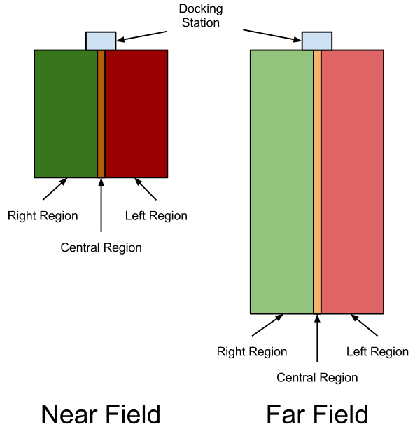

Docking Stations
================

About
-----

Docking stations are an optional extra that can enable Kobuki to autonomously recharge as needed (with a little programming). 

How it Works
------------

Kobuki's docking station has 3 IR **emitters** positioned on the left, right and centre of the docking station. Each emitter beams encoded signals
in a manner that will ensure coverage of the area in front of the docking station partitioned in six areas - left, right and centre, further
subdivided near and far as illustrated below.

Three **receivers** are also positioned left, right and centre on the docking station and will receive a mix of the signals hitherto sent
from the emitters and bounced off any object in range of the docking station (i.e. an incoming Kobuki). If for example, Kobuki was
still far from the docking station and in the left region, then both left and centre signals will receive the *FAR_LEFT* state and the
right receiver will record null. This is sufficient to enable a simple docking algorithm to work robustly, even if the solution may
not always be elegant due to a lack of resolution on the range axis (merely bifurcates, near and far).

Software
--------

.. todo:: 

   In need of someone owning a docking station to assist with usage of kobuki_dock_drive library and example demo
