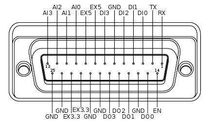

Working with Embedded Boards
============================

Cross Compiling
---------------

Getting Started
^^^^^^^^^^^^^^^

Kobuki is c++ and built using CMake, so to cross-compile, these instructions will take advantage
of CMake Toolchains, configuration which of is dependent on the c++ toolchain being used to
compile the libraries.

For a primer on CMake and how to define CMake toolchains, refer to the cmake manual -
`cmake toolchains <https://cmake.org/cmake/help/latest/manual/cmake-toolchains.7.html>`_.

An Example
^^^^^^^^^^

Preparation
...........

Let's get hands on and use one of the c++ toolchains provided by Ubuntu 20.04 as an example.

.. note::

   You are not limited by what your linux distro provides, pretty much any downloadable gcc
   toolchain can be enabled this one, just merely point your cmake toolchain configuration to
   wherever you have installed your toolchain.

Download a toolchain:

.. code-block:: bash

   sudo apt install g++-arm-linux-gnueabihf

This is the generic toolchain for arm cores with hard-float capabilities (usually the more powerful
variety of arm cores). You will find the toolchain installed in :maroon:`/usr/arm-linux-gnueabihf/`.
Next, create a cmake toolchain file that will instruct cmake on where to find your toolchain, your
your staging area and set appropriate CXX Flags for your target:

.. code-block:: cmake

   set(TOOLCHAIN_TUPLE "arm-linux-gnueabihf" CACHE STRING "Toolchain signature identifying cpu-vendor-platform-clibrary.")
   set(TOOLCHAIN_ROOT "/usr/${TOOLCHAIN_TUPLE}" CACHE STRING "Root of the target development environment (libraries, headers etc).")

   # Target information
   set(CMAKE_SYSTEM_NAME Linux)
   set(CMAKE_SYSTEM_PROCESSOR "arm")
   unset(CMAKE_Fortran_COMPILER)  # This toolchain doesn't have a fortran compiler
   set(CMAKE_C_COMPILER   ${TOOLCHAIN_TUPLE}-gcc) # Make sure these are in your PATH
   set(CMAKE_CXX_COMPILER ${TOOLCHAIN_TUPLE}-g++)

   # Search paths - only dig around in the toolchain root and staging area
   set(CMAKE_FIND_ROOT_PATH "${TOOLCHAIN_SYSROOT};${CMAKE_CURRENT_LIST_DIR}/install" CACHE STRING "Cmake search variable for finding libraries/headers.")
   set(CMAKE_FIND_ROOT_PATH_MODE_PROGRAM NEVER) # Don't search for programs outside of CMAKE_FIND_ROOT_PATH and CMAKE_SYSROOT
   set(CMAKE_FIND_ROOT_PATH_MODE_LIBRARY ONLY)  # ... libraries
   set(CMAKE_FIND_ROOT_PATH_MODE_INCLUDE ONLY)  # ... headers
   set(CMAKE_FIND_ROOT_PATH_MODE_PACKAGE ONLY)  # ... cmake modules

   # CXX Flags specific to the target platform (typical raspberry pi platform)
   #
   #  - benchmark yourself, mileage will vary considerably, large speedups to be gained
   #  - a good starting point is https://wiki.gentoo.org/wiki/Safe_CFLAGS#ARMv6.2FARM1176JZF-S
   #
   # Also, -Wno-psabi avoids irritating gcc 7.1 warnings about not mixing binaries with gcc 6 binaries
   #
   set(CMAKE_CXX_FLAGS "-march=armv7 -mtune=arm1176jzf-s -pipe -mfloat-abi=hard -mfpu=vfp -Wno-psabi" CACHE STRING "flags specific for an armv7/arm1176jzf-s platform")

   # Hide from cache's front page
   MARK_AS_ADVANCED(CMAKE_GENERATOR CMAKE_FIND_ROOT_PATH CMAKE_TOOLCHAIN_FILE TOOLCHAIN_FAMILY TOOLCHAIN_TUPLE)

It can be named whatever you please, here we'll refer to it as :maroon:`arm-linux-gnueabihf.cmake`. In other
circumstances, toolchain, staging area and cxx flags would be handled separately for maximum flexibility,
but one file here keeps things simple to get started.

Building
........

Follow the instructions for setting up the sources as in :ref:`Software - Preparation <build2-section>`,
but stop short of building, we'll do that a little differently here. Namely:

1. Configure your :maroon:`PATH` so that your toolchain can be found
2. Point cmake at your toolchain file

The modified instructions for building:

.. code-block:: bash

   $ export PATH=${PATH}:/usr/arm-linux-gnueabihf/bin
   $ export CMAKE_ARGS="-DBUILD_TESTING=OFF --no-warn-unused-cli"
   $ export CROSS_COMPILE_ARGS=-DCMAKE_TOOLCHAIN_FILE=`pwd`/arm-linux-gnueabihf.cmake
   $ colcon build --merge-install --cmake-args ${CMAKE_ARGS} ${CROSS_COMPILE_ARGS}

Other variations on the build step still hold as per the instructions
in :ref:`Software - Build <build-section>`.

These instructions are continuously vetted with a github action
(`yaml <https://github.com/kobuki-base/kobuki_documentation/blob/devel/.github/workflows/weekly.yaml>`_,
`results/logs <https://github.com/kobuki-base/kobuki_documentation/actions?query=workflow%3Abuild_sources>`_). 

Using The Serial Port (!USB)
----------------------------

If your embedded board has a serial port rather than a USB, you're in luck, Kobuki has that too
via it's expansion port.

You most likely will have to wire your own cable. For correct pin-to-pin connections, refer to the
diagrams in the anatomy section on the :ref:`anatomy_expansion_port-section`.

Reproducing here for convenience:

The minimum number of required pins for serial communication is three; TX, RX, and GND.
Additionally EX3.3 or EX5 can be used for powering external devices, such as line transceiver.

Once connected, you should find your kobuki on one of the `/dev/ttySN` ports (N = 1, 2, ...). Simply
pass that string as the serial port identifier in the initialisation phase of your software
applications.
