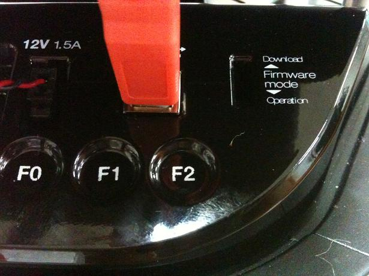

.. _firmware-section:

Firmware
========

Versioning
----------

Firmware versions follow `semantic versioning`_ rules. The `c++ driver`_ 
checks for compatibility between the software (i.e. driver) and firmware.
Firmware versions are of the form M.m.p:

- **M(ajor)** versions typically break protocol compatibility. When software and firmware are incompatible, the software will emit an error, suggest the required update and shutdown.
- **m(inor)** versions add features, but the protocol will have not been modified. Software and firmware will inter-operate, but warnings will be issued just-in-time when features are used that aren't supported by the connected firmware.
- **p(atch)** versions provide minor bugfixes, but do not break driver or protocol compatibility.

Additionally, the software maintains a list of recommended versions. Even if there is only a minor or patch
version difference, it will give you a warning on connection and suggest the recommended firmware version
to upgrade to. For example:

.. code-block:: bash
   
   $ kobuki-simple-keyop 

   Simple Keyop : Utility for driving kobuki by keyboard.

   Reading from keyboard
   ---------------------
   Forward/back arrows : linear velocity incr/decr.
   Right/left arrows : angular velocity incr/decr.
   Spacebar : reset linear/angular velocities.
   q : quit.
   
   [WARNING] The firmware does not match any of the recommended versions for this software.
   [WARNING] Consider replacing the firmware. For more information,
   [WARNING] refer to https://kobuki.readthedocs.io/en/devel/firmware.html.
   [WARNING]  - Firmware Version: 1.1.3
   [WARNING]  - Recommended Versions: 1.1.4 / 1.2.0

   current pose: [x: 5.61871e-310, y: 1.57358e-314, heading: 6.90938e-310]
   current pose: [x: 5.61871e-310, y: 1.57358e-314, heading: 6.90938e-310]

The `c++ driver`_ provides a utility for checking the version that is running
on your kobuki. It will also provide versioning information for the driver (software)
and hardware:

.. code-block:: bash

   $ kobuki-version-info
     Version Info:
      * Hardware Version: 1.0.4
      * Firmware Version: 1.2.0
      * Software Version: 1.0.0
      * Unique Device ID: 97713968-842422349-1361404194

Additionally, firmware binaries come in three flavours:

* *latest*: most recent, but be aware that this version hasn't been tested much
* *stable*: more recent than factory and reasonably well tested
* *factory*: flashed onto the robots at the factory, has undergone stress testing

These are identified by the trailing suffix on binary filenames stored in the
`kobuki_firmware`_ repository.

More details on the specific features / fixes provided by each version can be found
in the kobuki firmware `CHANGELOG <https://github.com/kobuki-base/kobuki_firmware/blob/devel/CHANGELOG.rst>`_.
  
.. _kobuki_firmware: https://github.com/kobuki-base/kobuki_firmware/tree/devel/firmware
.. _c++ driver: https://github.com/kobuki-base/kobuki_core
.. _semantic versioning: https://semver.org/

.. _updating-firmware:

Updating Firmware
-----------------

Kobuki's come pre-flashed from the factory. The only time you should need to upgrade
is if you have an older version and wish to catch new fixes or features.

Linux
~~~~~

The Flashing Utility
********************
.. code-block:: bash

  # Download stm32flash-0.4.gz from https://sourceforge.net/projects/stm32flash/files/
  $ tar -xvzf stm32flash-0.4.tar.gz
  $ cd stm32flash
  $ make

Download Firmware
*****************
.. code-block:: bash

  # Choose & download from https://github.com/kobuki-base/kobuki_firmware/tree/devel/firmware
  # e.g. latest
  $ wget --no-check-certificate --content-disposition https://github.com/kobuki-base/kobuki_firmware/blob/devel/firmware/kobuki_firmware_1.2.0-latest.hex?raw=true

Identify The COM Port
*********************

If you have a udev rule installed, it will show up as `/dev/kobuki`. If not, you
can typically find it under one of the ttyUSB ports, e.g. /dev/ttyUSB0.
If you are not sure, type `dmesg` into a terminal, unplug and replug the robot
and type `dmesg` again. You should now be able to see which port is assigned to the robot.

Switch to Download Mode
***********************

#. Connect the robot to your PC using the USB cable
#. Turn off the robot (switch on the side)
#. Switch from normal runtime mode to firmware download mode

This simply changes the type of data that is sent back and forth along the usb connection.
You can do this by moving the switch illustrated below into the ‘download’ (up) position.
Note that this switch is embedded into the robot cover so it isn’t easily thrown by
accident - you may need thin plyers or some similar tool. You can find the mode switch
mechanism on the right side of the control panel:

Flashing
********

.. NOTE:: 
  The following instructions assume flashing of kobuki_firmware_1.2.0-latest.hex and port /dev/ttyUSB0. 
  Modify these as necessary.

.. WARNING:: you need to execute the flashing command IMMEDIATELY after turning the robot on!

#. Turn off the robot
#. Check that the switch is in download mode
#. Turn on the robot

.. code-block:: bash

  $ ./stm32flash -b 115200 -w kobuki_firmware_1.2.0-latest.hex /dev/ttyUSB0
    stm32flash 0.4

    http://stm32flash.googlecode.com/

    Using Parser : Intel HEX
    Interface serial_posix: 115200 8E1
    Version      : 0x22
    Option 1     : 0x00
    Option 2     : 0x00
    Device ID    : 0x0414 (High-density)
    - RAM        : 64KiB  (512b reserved by bootloader)
    - Flash      : 512KiB (sector size: 2x2048)
    - Option RAM : 16b
    - System RAM : 2KiB
    Write to memory
    Erasing memory
    Wrote address 0x0800a3f0 (100.00%) Done.

Reboot
******

- Turn off the robot power
- Flick the firmware switch back to ‘Operation’ mode.
- Turn on the robot power
- I’m happy, you should be too!

Windows
~~~~~~~

The Flashing Utility
********************

- Find, download and install *Flash_Loader_Demonstrator_v2.5.0_Setup.exe*.

Download Firmware
*****************

Choose & download from `kobuki_firmware/firmware <https://github.com/kobuki-base/kobuki_firmware/tree/devel/firmware>`_.

Identify the COM Port
*********************

Usually this will show up on COM1, but check to make sure.

Switch to Download Mode
***********************

#. Connect the robot to your PC using the USB cable
#. Turn off the robot (switch on the side)
#. Switch from normal runtime mode to firmware download mode

This simply changes the type of data that is sent back and forth along the usb connection.
You can do this by moving the switch illustrated below into the ‘download’ (up) position.
Note that this switch is embedded into the robot cover so it isn’t easily thrown by
accident - you may need thin plyers or some similar tool. You can find the mode switch
mechanism on the right side of the control panel - see the image below.

Flashing
********
#. Turn off the robot
#. Check that the switch is in download mode
#. Turn on the robot

.. |flash1| image:: images/windows_flash_1.jpg
.. |flash2| image:: images/windows_flash_2.jpg
.. |flash3| image:: images/windows_flash_3.jpg
.. |flash4| image:: images/windows_flash_4.jpg

+------------------------------------------+-------------------------------------+
| |flash1|                                 | |flash2|                            |
+------------------------------------------+-------------------------------------+
| Configure Properties                     | Check that the target is identified |
+------------------------------------------+-------------------------------------+
| |flash3|                                 | |flash4|                            |
+------------------------------------------+-------------------------------------+
| Enter the Download from file (your .hex) | Success!                            |
+------------------------------------------+-------------------------------------+

Rebooting
*********

- Turn off the robot power
- Flick the firmware switch back to ‘Operation’ mode.
- Turn on the robot power
- I’m happy, you should be too!

Special Firmware Modes
----------------------

Activating
~~~~~~~~~~
Kobuki has some special firmware modes, which can be activated on startup.

* Random Walker
* Arduino/Embedded Board support mode

To activate one of them, follow these instructions:

* Turn on Kobuki.
* Within in the first 3 seconds press and hold either button BO (Random Walker) or B1 (Arduino) for 2 seconds
* If you see LED2 (Random Walker) or LED1 (Arduino) switching between red and green, your chosen mode has been activated.

.. NOTE:: These modes have been introduced to the firmware with version 1.1.0. In case your Kobuki is not running this or a later version, please refer to the section about updating the firmware.

Random Walker Mode
~~~~~~~~~~~~~~~~~~

In random walker mode Kobuki is driving around until it hits an object with the bumper or a cliff is detected. In both cases, Kobuki will stop, turn by a random amount of degrees and continue driving .

.. WARNING:: In this mode Kobuki’s wheel drop sensors are not activated. So, be careful when lifting up Kobuki!

Arduino / Embedded Board Support Mode
~~~~~~~~~~~~~~~~~~~~~~~~~~~~~~~~~~~~~

In this mode the serial port (DB25 connector) gives access to basic controls of Kobuki. You can hook up the digital/analog inputs/outpus of your Arduino or other embedded boards and start writing simple control programs.

Below is the special pin setting listed. Please refer to the serial port description for the name to pin mapping.

- DI0: Not used
- DI1: Not used
- DI2: Not used
- DI3: Not used
- DO0: Bumper left (pressed/released)
- DO1: Bumper centre (pressed/released)
- DO2: Bumper right (pressed/released)
- DO3: Wheel drop sensors (at least one wheel is dropped / none is dropped)
- AI0: Wheel speed right (0V - full speed backward, 3.3V - full speed forward)
- AI1: Wheel speed left (0V - full speed backward, 3.3V - full speed forward)
- AI2: Not used
- AI3: Not used

All other pins (GND, RX, TX etc.) remain unchanged.

.. NOTE:: To enable the motors you need to press button B0.

