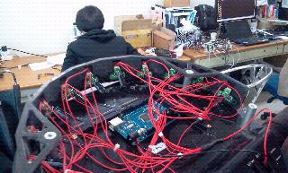

Hardware Extensions
===================

Overview
--------

Kobuki provides additional :ref:`power-section` connections and an :ref:`anatomy_expansion_port-section`
with analog & digital io (and additional power connections) that let you extend the
capabilities of your Kobuki in wierd and wonderful ways. Refer to those links for specific details.

Some interesting examples to follow.

Use Case - Payload Balancing
----------------------------

.. note:: 

   Kobuki's ancestry belongs to cleaning robot lines and consequently
   wasn't designed for handling variations in payload. Sometimes you'll
   need to provide some assistance!

When you start mounting additional equipment on Kobuki, the kinematic
and dynamic motion envelopes will start to be considerably affected as
the centre of gravity shifts. This is particularly important when it
comes to Kobuki's ability to traverse small obstacles or slopes
as it travels in the longitudinal direction.

In these cases, simply design some weights that can be mounted, like
ballast, to shift the centre of gravity to where you need it. An example
of such were the
metal `cylindrical pipes <https://store10227366.ecwid.com/Dummy-Pipe-Set-p72589155>`_
designed for the Turtlebot 2. These could be affixed around poles attached to the
screws on the back of the kobuki.

.. table::
   :align: center

   +----------------------------------+------------------------------------+
   | .. image:: images/dummy_pipe.png | .. image:: images/attach_pipes.png |
   +----------------------------------+------------------------------------+
   | Steel Anchor Weights             | Placement                          |
   +----------------------------------+------------------------------------+

* Reference model diagrams for counterweights: `igs <https://github.com/kobuki-base/kobuki_resources/blob/devel/hardware/models/igs/counterweight.igs>`_, `stp <https://github.com/kobuki-base/kobuki_resources/blob/devel/hardware/models/step/counterweight.stp>`_

Use Case - 3D Sensor
--------------------

Depth sensors are typically connected to the 12V 1.5A power supply and via
USB to your compute board (netbook/embedded board). To do this you'll need
to modify the power capable with the connector specified in the :ref:`power-section`
section.

.. todo:: Could really use a step-by-step pictorial walkthrough.

Use Case - Laptop Recharging
----------------------------

.. note::

   Recharging mode will only activate when the Kobuki itself is being recharged
   (otherwise the current draw would have a detrimental affect on runtime
   performance). This is true for both dock / cable recharging. 

Similar to the depth sensor use case, you'll need to modify the recharging
cable for a netbook and attach it to the 19V\@2A connector (refer to the
:ref:`power-section` section) to take advantage of the on-board power supply. This is
not only extremely convenient (no more detaching/reattaching) but will also
permit you to completely automate your application.

Most turtlebot 2 suppliers would provide a netbook / modified cable with the
full solution.

.. todo:: Could really use a step-by-step pictorial walkthrough.

Use Case - IR Sensor Array
--------------------------

Kobuki usually gets equipped with a 3d sensor, however, these typically have limitations
for the purposes of obstacle avoidance:

* Narrow fov (58° x 43° horizontal x vertical)
* Death zone in the first 45 cm
* Cannot detect glass walls
* Cannot reliably detect polished metallic or very black surfaces

In one experiment an 11 IR sensors half ring, pointing 12 degrees downward was added to compensate.

* Sensor model: Sharp GP2Y0A21YK
* Power supply: Kobuki’s 5V, 1A
* Sensor reading: Arduino MEGA 2560
* PC interface: Arduino custom firmware – Bosch adc_driver
* Mounting: 3D printed frame.

.. table::
   :align: center

   +------------------------------------------------------+-------------------------------------------------------+--------------------------------------------------------+
   | .. image:: images/arrays/kobuki_psd_array_brk_90.jpg | .. image:: images/arrays/kobuki_psd_array_brk_110.jpg | .. image:: images/arrays/kobuki_sonar_array_brk_90.jpg |
   +------------------------------------------------------+-------------------------------------------------------+--------------------------------------------------------+
   |       PSD Array I                                    | PSD Array II                                          | Sonar Array                                            |
   +------------------------------------------------------+-------------------------------------------------------+--------------------------------------------------------+

The analog output of sensors is read by the Arduino board, while for power and ground
they are connected to Kobuki’s 5V 1A power source. Connecting several sensors to the same
power supply makes readings very noisy when there aren’t obstacles. The solution
was to put decoupling capacitors on each sensor. For interfacing Arduino, we
use Bosch adc_driver.

Different mounting frames are available for downloading and printing in our file server:

* Horizontally mounted MaxBotix’s LV-Maxsonars
* Horizontally mounted Sharp IR sensors
* 12 degrees downward pointing Sharp IR sensors

