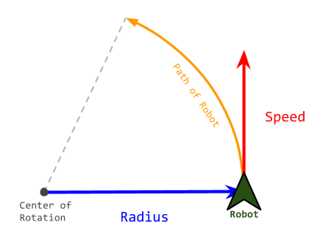
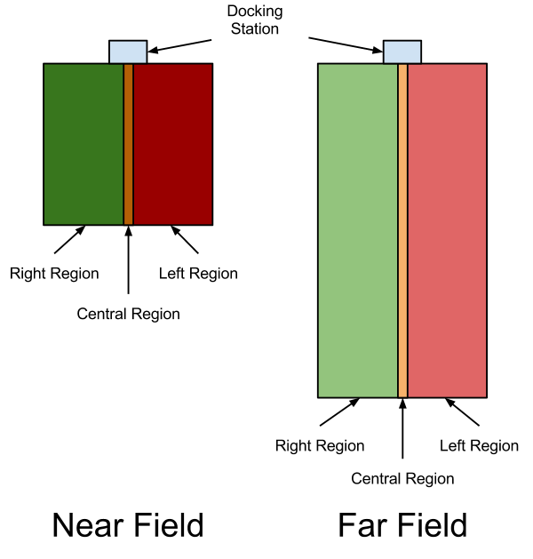

Serial Protocol
===============

About
-----

A software program communicates with the robot by using predefined protocol on the serial or usb-serial
lines. The provided c++ library, :maroon:`libkobuki.so` does this for you, so in most cases, understanding
the serial protocol is not necessary. This section is for implementers of libraries attempting to communciate
with the Kobuki via either a different language (e.g. java) or their own custom c++ implementation.

In general, commands are sent to the robot on the RX line and responses / sensor readings are streamed
back on the TX line at a rate of 20ms.  

Data Types
----------

Types
^^^^^

Data fields used in commands or payloads can be in the form of one of the three data types specified below:

+-----------------+--------------------+-------+------+-----------------+---------------------------+
| Name           | Description         | Bytes | Bits | Range           | C/C++ Identifier          |
+================+=====================+=======+======+=================+================+==========+
| Unsigned Byte  | 8-bit unsigned int  | 1     | 8    | 0~255           | unsigned char  | uint8_t  | 
+----------------+---------------------+-------+------+-----------------+----------------+----------+
| Unsigned Short | 16-bit unsigned int | 2     | 16   | 0~65,535        | unsigned short | uint16_t |
+----------------+---------------------+-------+------+-----------------+----------------+----------+
| Unsigned Int   | 32-bit unsigned int | 4     | 32   | 0~4,294,967,295 | unsigned int   | uint32_t |
+----------------+---------------------+-------+------+-----------------+----------------+----------+

Ordering
^^^^^^^^

Data for the multi-byte types are in `LSB <http://en.wikipedia.org/wiki/Least_significant_byte>`_ order.
This means the least significant byte will come first in the bytestream, for example, the integer 
2,864,434,397 (0xAABBCCDD) will be represented in the bytestream as:

+------+------+------+------+
| 0xDD | 0xCC | 0xBB | 0xAA |
+------+------+------+------+

The ByteStream
--------------

Structure
^^^^^^^^^

The returning stream consists of packets that combine both sensor data and responses to requests
that have been sent in the previous cycle. A bytestream can be divided into 4 fields:
Headers, Length, Payload and Checksum.

+------------+---------+------------+-------------+-----+---------------+--------------+
| **Headers**          | **Length** | **Payload**                       | **Checksum** |
+------------+---------+            +-------------+-----+---------------+              +
| Header0    | Header1 |            | SubPayload0 | ... | SubPayloadN-1 |              |
+------------+---------+------------+-------------+-----+---------------+--------------+

+-----------------+----------+----------+--------------+-----------+------------------------+
| Name            | Header 0 | Header 1 | Length       | Payload   | Checksum               |
+=================+==========+==========+==============+===========+========================+
| **Size**        | 1 Byte   | 1 Byte   | 1 Byte       | N Bytes   | 1 Byte                 |
+-----------------+----------+----------+--------------+-----------+------------------------+
| **Description** | 0xAA     | 0x55     | Payload size | See below | XOR (length + payload) |
+-----------------+----------+----------+--------------+-----------+------------------------+

Headers
^^^^^^^

Two bytes of headers, header 0 and header 1, are of fixed value for both bytestreams,
commands and feedback data. This headers are used to detect the starting point of bytestream.

Length
^^^^^^

Length is a single byte that indicates size of the variable payload (in bytes).
Length can be used to distinguish each bytestreams. Minimum value of this field is 3.

Payload
^^^^^^^

The payload is where the gold (actual data) is!

A **payload** is actually representative of several sub-payloads stitched together. 

+-------------+-------------+-------------+-----+----------------+
| Payload                                                        |
+=============+=============+=============+=====+================+
| SubPayload0 | SubPayload1 | SubPayload2 | ... | SubPayload N-1 |
+-------------+-------------+-------------+-----+----------------+

**Sub-payloads** can be divided into three parts; Header, Length and Data:

+-----------------+------------+--------------+-----------+
| **Name**        | Header     | Length       | Data      |
+=================+============+==============+===========+
| **Size**        | 1 Byte     | 1 Byte       | N Byte(s) |
+-----------------+------------+--------------+-----------+
| **Description** | Identifier | Size of data | See below |
+-----------------+------------+--------------+-----------+

Checksum
^^^^^^^^

The checksum is the XOR'ed value of the entire bytestream sans the headers.
This is used as a check to ensure the integrity of the contents of the bytestream since
individual bytes can be easily corrupted on the wire.

A c++ code snippet demonstrating the algorithm used:

.. code-block:: c++

   unsigned int packet_size(buffer.size());
   unsigned char cs(0);
   for (unsigned int i = 2; i < packet_size; i++)
   {
     cs ^= buffer[i];
   }
   return cs ? false : true;

Command Packets
---------------

Command Identifiers
^^^^^^^^^^^^^^^^^^^

+---------+------------------------+-------------------------------------------+
| ID      | Name                   | Description                               |
+=========+========================+===========================================+
| 1       | Base Control           | Control wheel motors                      |
+---------+------------------------+-------------------------------------------+
| 2       | Reserved               |                                           |
+---------+------------------------+-------------------------------------------+
| 3       | Sound                  | Play custom sounds                        |
+---------+------------------------+-------------------------------------------+
| 4       | Sound Sequence         | Play predefined sound sequences           |
+---------+------------------------+-------------------------------------------+
| 5       | Reserved               |                                           |
+---------+------------------------+-------------------------------------------+
| 6       | Reserved               |                                           |
+---------+------------------------+-------------------------------------------+
| 7       | Reserved               |                                           |
+---------+------------------------+-------------------------------------------+
| 8       | Reserved               |                                           |
+---------+------------------------+-------------------------------------------+
| 9       | Request Extra          | Request extra information                 |
+---------+------------------------+-------------------------------------------+
| 10      | Reserved               |                                           |
+---------+------------------------+-------------------------------------------+
| 11      | Reserved               |                                           |
+---------+------------------------+-------------------------------------------+
| 12      | General Purpose Output | Control general purpose outputs           |
+---------+------------------------+-------------------------------------------+
| 13      | Set Controller Gain    | Set PID gain of wheel velocity controller |
+---------+------------------------+-------------------------------------------+
| 14      | Get Controller Gain    | Get PID gain of wheel velocity controller |
+---------+------------------------+-------------------------------------------+

Base Control
^^^^^^^^^^^^

Control wheel motors to moving robot. Robot will follow the arc line, which radius
is <Radius> mm, with <Speed> mm/s. Positive Radius indicates center of arc line that
robot follows is located at the left side of the robot. Negative is opposite.

But actual value of speed field is little bit different. Here is conversion table.

+------------------------+----------------------------------------------------+------------+
| Motion                 | Speed(mm/s)                                        | Radius(mm) |
+========================+====================================================+============+
| Pure Translation       | Speed                                              | 0          |
+------------------------+----------------------------------------------------+------------+
| Pure Rotation          | w*b / 2                                            | 1          |
+------------------------+----------------------------------------------------+------------+
| Translation + Rotation | Speed * (Radius + b) / 2 ) / Radius, if Radius > 1 | Radius     |
+------------------------+----------------------------------------------------+------------+
|                        | Speed * (Radius - b / 2 ) / Radius, if Radius < -1 | Radius     |
+------------------------+----------------------------------------------------+------------+

* :maroon:`w` is rotation speed of the robot, in [rad/s].
* :maroon:`b` is bias or wheelbase, that indicates the length between the center of the wheels.

+------------+--------------------+------+-------+------+-------------+
|            | Name               | Size | Value | Hex  | Description |
+============+====================+======+=======+======+=============+
| **Header** | Identifier         | 1    | 1     | 0x01 | Fixed       |
+------------+--------------------+------+-------+------+-------------+
| **Length** | Size of data field | 1    | 4     | 0x04 | Fixed       |
+------------+--------------------+------+-------+------+-------------+
| **Data**   | Speed              | 2    |       |      | in mm/s     |
+------------+--------------------+------+-------+------+-------------+
|            | Radius             | 2    |       |      | in mm       |
+------------+--------------------+------+-------+------+-------------+

Sound
^^^^^

Play custom sounds with note and duration.

+------------+--------------------+------+-------+------+-----------------------------------------------------------+
|            | Name               | Size | Value | Hex  | Description                                               |
+============+====================+======+=======+======+===========================================================+
| **Header** | Identifier         | 1    | 3     | 0x03 | Fixed                                                     |
+------------+--------------------+------+-------+------+-----------------------------------------------------------+
| **Length** | Size of data field | 1    | 3     | 0x03 | Fixed                                                     |
+------------+--------------------+------+-------+------+-----------------------------------------------------------+
| **Data**   | Note               | 2    |       |      | 1 / (f*a), where f is the frequency (Hz), a is 0.00000275 |
+------------+--------------------+------+-------+------+-----------------------------------------------------------+
|            | Duration           | 1    |       |      | Duration of playing note in milli-seconds                 |
+------------+--------------------+------+-------+------+-----------------------------------------------------------+

.. note:: 

   This command is implemented on the kobuki with firmware, but not implemented yet in the c++ library
   (kobuki_driver).

Sound Sequence
^^^^^^^^^^^^^^

Play predefined sounds by its index.

+------------+--------------------+------+-------+------+---------------------------+
|            | Name               | Size | Value | Hex  | Description               |
+============+====================+======+=======+======+===========================+
| **Header** | Identifier         | 1    | 4     | 0x04 | Fixed                     |
+------------+--------------------+------+-------+------+---------------------------+
| **Length** | Size of data field | 1    | 1     | 0x01 | Fixed                     |
+------------+--------------------+------+-------+------+---------------------------+
| **Data**   | Sequence number    | 1    |       |      | 0 for ON sound            |
+------------+--------------------+------+-------+------+---------------------------+
|            |                    |      |       |      | 1 for OFF sound           |
+------------+--------------------+------+-------+------+---------------------------+
|            |                    |      |       |      | 2 for RECHARGE sound      |
+------------+--------------------+------+-------+------+---------------------------+
|            |                    |      |       |      | 3 for BUTTON sound        |
+------------+--------------------+------+-------+------+---------------------------+
|            |                    |      |       |      | 4 for ERROR sound         |
+------------+--------------------+------+-------+------+---------------------------+
|            |                    |      |       |      | 5 for CLEANINGSTART sound |
+------------+--------------------+------+-------+------+---------------------------+
|            |                    |      |       |      | 6 for CLEANINGEND sound   |
+------------+--------------------+------+-------+------+---------------------------+

Request Extra
^^^^^^^^^^^^^

Request extra data from robot. Especially version info of kobuki; Hardware Version,
Firmware Version and Unique Device IDentifier(UDID)

UDID is unique to device. so can be used to identify on multiple robots.

+------------+--------------------+------+-------+------+-------------------------------------+
|            | Name               | Size | Value | Hex  | Description                         |
+============+====================+======+=======+======+=====================================+
| **Header** | Identifier         | 1    | 9     | 0x09 | Fixed                               |
+------------+--------------------+------+-------+------+-------------------------------------+
| **Length** | Size of data field | 1    | 2     | 0x02 | Fixed                               |
+------------+--------------------+------+-------+------+-------------------------------------+
| **Data**   | Request flags      | 2    |       |      | Set the flags to request extra data |
+------------+--------------------+------+-------+------+-------------------------------------+
|            |                    |      |       |      | 0x01 for Hardware Version           |
+------------+--------------------+------+-------+------+-------------------------------------+
|            |                    |      |       |      | 0x02 for Firmware Version           |
+------------+--------------------+------+-------+------+-------------------------------------+
|            |                    |      |       |      | 0x08 for Unique Device ID           |
+------------+--------------------+------+-------+------+-------------------------------------+

General Purpose Output
^^^^^^^^^^^^^^^^^^^^^^

This command has multiple roles. It controls LEDs, digital outputs and external powers.

+------------+------------------------+------+-------+------+------------------------------------------------------------+
|            | Name                   | Size | Value | Hex  | Description                                                |
+============+========================+======+=======+======+============================================================+
| **Header** | Identifier             | 1    | 12    | 0x0C | Fixed                                                      |
+------------+------------------------+------+-------+------+------------------------------------------------------------+
| **Length** | Size of data field     | 1    | 2     | 0x02 | Fixed                                                      |
+------------+------------------------+------+-------+------+------------------------------------------------------------+
| **Data**   | Digital output flags 2 |      |       |      | Set the flags to set high on output pins of expansion port |
+------------+------------------------+------+-------+------+------------------------------------------------------------+
|            |                        |      |       |      | 0x0001 for digital output ch. 0                            |
+------------+------------------------+------+-------+------+------------------------------------------------------------+
|            |                        |      |       |      | 0x0002 for digital output ch. 1                            |
+------------+------------------------+------+-------+------+------------------------------------------------------------+
|            |                        |      |       |      | 0x0004 for digital output ch. 2                            |
+------------+------------------------+------+-------+------+------------------------------------------------------------+
|            |                        |      |       |      | 0x0008 for digital output ch. 3                            |
+------------+------------------------+------+-------+------+------------------------------------------------------------+
|            |                        |      |       |      |                                                            |
+------------+------------------------+------+-------+------+------------------------------------------------------------+
|            |                        |      |       |      | Set the flags to turn on external powers                   |
+------------+------------------------+------+-------+------+------------------------------------------------------------+
|            |                        |      |       |      | 0x0010 for external power 3.3V ch.                         |
+------------+------------------------+------+-------+------+------------------------------------------------------------+
|            |                        |      |       |      | 0x0020 for external power 5V ch.                           |
+------------+------------------------+------+-------+------+------------------------------------------------------------+
|            |                        |      |       |      | 0x0040 for external power 12V/5A ch.                       |
+------------+------------------------+------+-------+------+------------------------------------------------------------+
|            |                        |      |       |      | 0x0080 for external power 12V/1.5A ch.                     |
+------------+------------------------+------+-------+------+------------------------------------------------------------+
|            |                        |      |       |      |                                                            |
+------------+------------------------+------+-------+------+------------------------------------------------------------+
|            |                        |      |       |      | Set the flags to turn on LEDs                              |
+------------+------------------------+------+-------+------+------------------------------------------------------------+
|            |                        |      |       |      | 0x0100 for red colour of LED1                              |
+------------+------------------------+------+-------+------+------------------------------------------------------------+
|            |                        |      |       |      | 0x0200 for green colour of LED1                            |
+------------+------------------------+------+-------+------+------------------------------------------------------------+
|            |                        |      |       |      | 0x0400 for red colour of LED2                              |
+------------+------------------------+------+-------+------+------------------------------------------------------------+
|            |                        |      |       |      | 0x0800 for green colour of LED2                            |
+------------+------------------------+------+-------+------+------------------------------------------------------------+

Set Controller Gain
^^^^^^^^^^^^^^^^^^^

Set PID gain of wheel velocity controller of robot.

+------------+--------------------+------+-------+------+----------------------------------+
|            | Name               | Size | Value | Hex  | Description                      |
+============+====================+======+=======+======+==================================+
| **Header** | Identifier         | 1    | 1     | 0x01 | Fixed                            |
+------------+--------------------+------+-------+------+----------------------------------+
| **Length** | Size of data field | 1    | 13    | 0x0D | Fixed                            |
+------------+--------------------+------+-------+------+----------------------------------+
| **Data**   | Type               | 1    |       |      | 0   for factory-default PID gain |
+------------+--------------------+------+-------+------+----------------------------------+
|            |                    |      |       |      | 1 for user-configured PID gain   |
+------------+--------------------+------+-------+------+----------------------------------+
|            | P gain             | 4    |       |      | Kp * 1000 (default: 100*1000)    |
+------------+--------------------+------+-------+------+----------------------------------+
|            | I gain             | 4    |       |      | Ki * 1000 (default: 0.1*1000)    |
+------------+--------------------+------+-------+------+----------------------------------+
|            | D gain             | 4    |       |      | Kd * 1000 (default: 2*1000)      |
+------------+--------------------+------+-------+------+----------------------------------+

Get Controller Gain
^^^^^^^^^^^^^^^^^^^

Request PID gain of wheel velocity controller of robot.

+------------+--------------------+------+-------+------+-------------+
|            | Name               | Size | Value | Hex  | Description |
+============+====================+======+=======+======+=============+
| **Header** | Identifier         | 1    | 1     | 0x01 | Fixed       |
+------------+--------------------+------+-------+------+-------------+
| **Length** | Size of data field | 1    | 14    | 0x0E | Fixed       |
+------------+--------------------+------+-------+------+-------------+
| **Data**   | unused             | 1    |       |      |             |
+------------+--------------------+------+-------+------+-------------+

Feedback Packets
----------------

Feedback Identifiers
^^^^^^^^^^^^^^^^^^^^

+----+--------------------------------+----------------------------------------------+--------------+
| ID | Name                           | Descritpion                                  | Availability |
+====+================================+==============================================+==============+
| 1  | Basic Sensor Data              | Basic core sensor data                       | By default   |
+----+--------------------------------+----------------------------------------------+--------------+
| 2  | Reserved                       |                                              |              |
+----+--------------------------------+----------------------------------------------+--------------+
| 3  | Docking IR                     | Signals from docking station                 | By default   |
+----+--------------------------------+----------------------------------------------+--------------+
| 4  | Inertial Sensor                | Gyro data both angle and angular velocity    | By default   |
+----+--------------------------------+----------------------------------------------+--------------+
| 5  | Cliff                          | PSD data facing floor                        | By default   |
+----+--------------------------------+----------------------------------------------+--------------+
| 6  | Current                        | Current of wheel motors                      | By default   |
+----+--------------------------------+----------------------------------------------+--------------+
| 7  | Reserved                       |                                              |              |
+----+--------------------------------+----------------------------------------------+--------------+
| 8  | Reserved                       |                                              |              |
+----+--------------------------------+----------------------------------------------+--------------+
| 9  | Reserved                       |                                              |              |
+----+--------------------------------+----------------------------------------------+--------------+
| 10 | Hardware Version               | Version number of kobuki hardware            | On request   |
+----+--------------------------------+----------------------------------------------+--------------+
| 11 | Firmware Version               | Version number of kobuki firmware            | On request   |
+----+--------------------------------+----------------------------------------------+--------------+
| 12 | Reserved                       |                                              |              |
+----+--------------------------------+----------------------------------------------+--------------+
| 13 | Raw data of 3-axis gyro        | Raw ADC data of digital 3-axis gyro          | By default   |
+----+--------------------------------+----------------------------------------------+--------------+
| 14 | Reserved                       |                                              |              |
+----+--------------------------------+----------------------------------------------+--------------+
| 15 | Reserved                       |                                              |              |
+----+--------------------------------+----------------------------------------------+--------------+
| 16 | General Purpose Input          | Inputs from 25-pin expansion port            | By default   |
+----+--------------------------------+----------------------------------------------+--------------+
| 17 | Reserved                       |                                              |              |
+----+--------------------------------+----------------------------------------------+--------------+
| 18 | Reserved                       |                                              |              |
+----+--------------------------------+----------------------------------------------+--------------+
| 19 | Unique Device IDentifier(UDID) | Unique number to identify robot              | On request   |
+----+--------------------------------+----------------------------------------------+--------------+
| 20 | Reserved                       |                                              |              |
+----+--------------------------------+----------------------------------------------+--------------+
| 21 | Controller Info                | PID gain values of wheel velocity controller | On request   |
+----+--------------------------------+----------------------------------------------+--------------+

Basic Sensor Data
^^^^^^^^^^^^^^^^^

.. note:: This sub-payload is always streamed.

+------------+---------------------+------+-------+------+------------------------------------------------------------------+
|            | Name                | Size | Value | Hex  | Description                                                      |
+============+=====================+======+=======+======+==================================================================+
| **Header** | Feedback Identifier | 1    | 1     | 0x01 | Fixed                                                            |
+------------+---------------------+------+-------+------+------------------------------------------------------------------+
| **Length** | Size of data field  | 1    | 15    | 0x0F | Fixed                                                            |
+------------+---------------------+------+-------+------+------------------------------------------------------------------+
| **Data**   | Timestamp           | 2    |       |      | Timestamp generated internally in milliseconds                   |
+------------+---------------------+------+-------+------+------------------------------------------------------------------+
|            |                     |      |       |      | It circulates from 0 to 65535                                    |
+------------+---------------------+------+-------+------+------------------------------------------------------------------+
|            | Bumper              | 1    |       |      | Flag will be setted when bumper is pressed                       |
+------------+---------------------+------+-------+------+------------------------------------------------------------------+
|            |                     |      |       |      | 0x01 for right bumper                                            |
+------------+---------------------+------+-------+------+------------------------------------------------------------------+
|            |                     |      |       |      | 0x02 for central bumper                                          |
+------------+---------------------+------+-------+------+------------------------------------------------------------------+
|            |                     |      |       |      | 0x04 for left bumper                                             |
+------------+---------------------+------+-------+------+------------------------------------------------------------------+
|            | Wheel drop          | 1    |       |      | Flag will be setted when wheel is dropped                        |
+------------+---------------------+------+-------+------+------------------------------------------------------------------+
|            |                     |      |       |      | 0x01 for right wheel                                             |
+------------+---------------------+------+-------+------+------------------------------------------------------------------+
|            |                     |      |       |      | 0x02 for left wheel                                              |
+------------+---------------------+------+-------+------+------------------------------------------------------------------+
|            | Cliff               | 1    |       |      | Flag will be setted when cliff is detected                       |
+------------+---------------------+------+-------+------+------------------------------------------------------------------+
|            |                     |      |       |      | 0x01 for right cliff sensor                                      |
+------------+---------------------+------+-------+------+------------------------------------------------------------------+
|            |                     |      |       |      | 0x02 for central cliff sensor                                    |
+------------+---------------------+------+-------+------+------------------------------------------------------------------+
|            |                     |      |       |      | 0x04 for left cliff sensor                                       |
+------------+---------------------+------+-------+------+------------------------------------------------------------------+
|            | Left encoder        | 2    |       |      | Accumulated encoder data of left and right wheels in ticks       |
+------------+---------------------+------+-------+------+------------------------------------------------------------------+
|            |                     |      |       |      | Increments of this value means forward direction                 |
+------------+---------------------+------+-------+------+------------------------------------------------------------------+
|            |                     |      |       |      | It circulates from 0 to 65535                                    |
+------------+---------------------+------+-------+------+------------------------------------------------------------------+
|            | Right encoder       | 2    |       |      | As above                                                         |
+------------+---------------------+------+-------+------+------------------------------------------------------------------+
|            | Left PWM            | 1    |       |      | PWM value that applied to left and right wheel motor             |
+------------+---------------------+------+-------+------+------------------------------------------------------------------+
|            |                     |      |       |      | This data should be converted signed type to represent correctly |
+------------+---------------------+------+-------+------+------------------------------------------------------------------+
|            |                     |      |       |      | Negative sign indicates backward direction                       |
+------------+---------------------+------+-------+------+------------------------------------------------------------------+
|            | Right PWM           | 1    |       |      | As above                                                         |
+------------+---------------------+------+-------+------+------------------------------------------------------------------+
|            | Button              | 1    |       |      | Flag will be setted when button is pressed                       |
+------------+---------------------+------+-------+------+------------------------------------------------------------------+
|            |                     |      |       |      | 0x01 for Button 0                                                |
+------------+---------------------+------+-------+------+------------------------------------------------------------------+
|            |                     |      |       |      | 0x02 for Button 1                                                |
+------------+---------------------+------+-------+------+------------------------------------------------------------------+
|            |                     |      |       |      | 0x04 for Button 2                                                |
+------------+---------------------+------+-------+------+------------------------------------------------------------------+
|            | Charger             | 1    |       |      | 0 for DISCHARGING state                                          |
+------------+---------------------+------+-------+------+------------------------------------------------------------------+
|            |                     |      |       |      | 2 for DOCKING_CHARGED state                                      |
+------------+---------------------+------+-------+------+------------------------------------------------------------------+
|            |                     |      |       |      | 6 for DOCKING_CHARGING state                                     |
+------------+---------------------+------+-------+------+------------------------------------------------------------------+
|            |                     |      |       |      | 18 for ADAPTER_CHARGED state                                     |
+------------+---------------------+------+-------+------+------------------------------------------------------------------+
|            |                     |      |       |      | 22 for ADAPTER_CHARGING state                                    |
+------------+---------------------+------+-------+------+------------------------------------------------------------------+
|            | Battery             | 1    |       |      | Voltage of battery in 0.1 V                                      |
+------------+---------------------+------+-------+------+------------------------------------------------------------------+
|            |                     |      |       |      | Typically 16.7 V when fully charged                              |
+------------+---------------------+------+-------+------+------------------------------------------------------------------+
|            | Overcurrent flags   | 1    |       |      | Flag will be setted when overcurrent is detected                 |
+------------+---------------------+------+-------+------+------------------------------------------------------------------+
|            |                     |      |       |      | 0x01 for left wheel                                              |
+------------+---------------------+------+-------+------+------------------------------------------------------------------+
|            |                     |      |       |      | 0x02 for right wheel                                             |
+------------+---------------------+------+-------+------+------------------------------------------------------------------+

Docking IR
^^^^^^^^^^

Signals from the docking station.

+------------+--------------------+------+-------+------+---------------------------------------------+
|            | Name               | Size | Value | Hex  | Description                                 |
+============+====================+======+=======+======+=============================================+
| **Header** | Identifier         | 1    | 3     | 0x03 | Fixed                                       |
+------------+--------------------+------+-------+------+---------------------------------------------+
| **Length** | Size of data field | 1    | 3     | 0x03 | Fixed                                       |
+------------+--------------------+------+-------+------+---------------------------------------------+
| **Data**   | Right signal       | 1    |       |      | Flag will be setted when signal is detected |
+------------+--------------------+------+-------+------+---------------------------------------------+
|            |                    |      |       |      | 0x01 for NEAR_LEFT state                    |
+------------+--------------------+------+-------+------+---------------------------------------------+
|            |                    |      |       |      | 0x02 for NEAR_CENTER state                  |
+------------+--------------------+------+-------+------+---------------------------------------------+
|            |                    |      |       |      | 0x04 for NEAR_RIGHT state                   |
+------------+--------------------+------+-------+------+---------------------------------------------+
|            |                    |      |       |      | 0x08 for FAR_CENTER state                   |
+------------+--------------------+------+-------+------+---------------------------------------------+
|            |                    |      |       |      | ox10 for FAR_LEFT state                     |
+------------+--------------------+------+-------+------+---------------------------------------------+
|            |                    |      |       |      | 0x20 for FAR_RIGHT state                    |
+------------+--------------------+------+-------+------+---------------------------------------------+
|            | Central signal     | 1    |       |      |                                             |
+------------+--------------------+------+-------+------+---------------------------------------------+
|            | Left signal        | 1    |       |      |                                             |
+------------+--------------------+------+-------+------+---------------------------------------------+
     
Kobuki's docking station has 3 IR emitters. The emitted IR lights cover three regions in front of the docking station: left, central and right, each divided in two sub-fields: near and far. Each beam encodes this information, so the robot knows at any moment in which region and sub-field he is. Also, as regions and fields are independently identified, they can be overlap on its borders.

Inertial Sensor Data
^^^^^^^^^^^^^^^^^^^^

.. note:: This sub-payload is always streamed.

Z-axis gyro data only available. 

+------------+--------------------+------+-------+------+--------------------+
|            | Name               | Size | Value | Hex  | Description        |
+============+====================+======+=======+======+====================+
| **Header** | Identifier         | 1    | 4     | 0x04 | Fixed              |
+------------+--------------------+------+-------+------+--------------------+
| **Length** | Size of data field | 1    | 7     | 0x07 | Fixed              |
+------------+--------------------+------+-------+------+--------------------+
| **Data**   | Angle              | 2    |       |      | Factory calibrated |
+------------+--------------------+------+-------+------+--------------------+
|            | Angle rate         | 2    |       |      | Factory calibrated |
+------------+--------------------+------+-------+------+--------------------+
|            | Unused             | 1    |       |      |                    |
+------------+--------------------+------+-------+------+--------------------+
|            | Unused             | 1    |       |      |                    |
+------------+--------------------+------+-------+------+--------------------+
|            | Unused             | 1    |       |      |                    |
+------------+--------------------+------+-------+------+--------------------+

Cliff Sensor Data
^^^^^^^^^^^^^^^^^

.. note:: This sub-payload is always streamed.

This value is related with distance between sensor and floor surface.
See the datasheet for more detailed information. 

+------------+----------------------+------+-------+-------------+-------------------------------------------+
|            | Name                 | Size | Value | Hex         | Description                               |
+============+======================+======+=======+=============+===========================================+
| **Header** | Identifier           | 1    | 5     | 0x05        | Fixed                                     |
+------------+----------------------+------+-------+-------------+-------------------------------------------+
| **Length** | Size of data field   | 1    | 6     | 0x06  Fixed |                                           |
+------------+----------------------+------+-------+-------------+-------------------------------------------+
| **Data**   | Right cliff sensor   | 2    |       |             | ADC output of each PSD                    |
+------------+----------------------+------+-------+-------------+-------------------------------------------+
|            |                      |      |       |             | Data range: 0 ~ 4095 (0 ~ 3.3V)           |
+------------+----------------------+------+-------+-------------+-------------------------------------------+
|            |                      |      |       |             | Distance range: 2 ~ 15 cm                 |
+------------+----------------------+------+-------+-------------+-------------------------------------------+
|            |                      |      |       |             | Distance is not linear w.r.t. ADC output. |
+------------+----------------------+------+-------+-------------+-------------------------------------------+
|            |                      |      |       |             | See the datasheet for more detail.        |
+------------+----------------------+------+-------+-------------+-------------------------------------------+
|            | Central cliff sensor | 2    |       |             | As above                                  |
+------------+----------------------+------+-------+-------------+-------------------------------------------+
|            | Left cliff sensor    | 2    |       |             | As above                                  |
+------------+----------------------+------+-------+-------------+-------------------------------------------+

Current
^^^^^^^

.. note:: This sub-payload is always streamed.

Current sensor readings of wheel motors.

+------------+--------------------+------+-------+------+-------------+
|            | Name               | Size | Value | Hex  | Description |
+============+====================+======+=======+======+=============+
| **Header** | Identifier         | 1    | 6     | 0x06 | Fixed       |
+------------+--------------------+------+-------+------+-------------+
| **Length** | Size of data field | 1    | 2     | 0x02 | Fixed       |
+------------+--------------------+------+-------+------+-------------+
| **Data**   | Left motor         | 2    |       |      | in 10mA     |
+------------+--------------------+------+-------+------+-------------+
|            | Right motor        | 2    |       |      | in 10mA     |
+------------+--------------------+------+-------+------+-------------+

Hardware Version
^^^^^^^^^^^^^^^^

.. note:: This sub-payload is sent only on request.

Hardware version info in triplet form; <major>.<minor>.<patch>

+------------+--------------------+------+-------+------+-------------+
|            | Name               | Size | Value | Hex  | Description |
+============+====================+======+=======+======+=============+
| **Header** | Identifier         | 1    | 10    | 0x0A | Fixed       |
+------------+--------------------+------+-------+------+-------------+
| **Length** | Size of data field | 1    | 4     | 0x04 | Fixed       |
+------------+--------------------+------+-------+------+-------------+
| **Data**   | Patch              | 1    |       |      |             |
+------------+--------------------+------+-------+------+-------------+
|            | Minor 1            |      |       |      |             |
+------------+--------------------+------+-------+------+-------------+
|            | Major 1            |      |       |      |             |
+------------+--------------------+------+-------+------+-------------+
|            | Unused             | 1    | 0     | 0x00 | Fixed       |
+------------+--------------------+------+-------+------+-------------+

Firmware Version
^^^^^^^^^^^^^^^^

.. note:: This sub-payload is sent only on request.

Firmware version info in triplet form; <major>.<minor>.<patch>

+------------+--------------------+------+-------+------+-------------+
|            | Name               | Size | Value | Hex  | Description |
+============+====================+======+=======+======+=============+
| **Header** | Identifier         | 1    | 11    | 0x0A | Fixed       |
+------------+--------------------+------+-------+------+-------------+
| **Length** | Size of data field | 1    | 4     | 0x04 | Fixed       |
+------------+--------------------+------+-------+------+-------------+
| **Data**   | Patch              | 1    |       |      |             |
+------------+--------------------+------+-------+------+-------------+
|            | Minor 1            |      |       |      |             |
+------------+--------------------+------+-------+------+-------------+
|            | Major 1            |      |       |      |             |
+------------+--------------------+------+-------+------+-------------+
|            | Unused             | 1    | 0     | 0x00 | Fixed       |
+------------+--------------------+------+-------+------+-------------+

Raw Data Of 3D Gyro
^^^^^^^^^^^^^^^^^^^

.. note:: This sub-payload is always streamed.

Raw ADC data of digital 3D gyro `L3G4200D <http://www.st.com/internet/analog/product/250373.jsp>`_.
Due to difference of acquisition rate and update rate, 2-3 data will be arrived at once.
Digit to deg/s ratio is 0.00875, it comes from
`datasheet <http://www.st.com/internet/com/TECHNICAL_RESOURCES/TECHNICAL_LITERATURE/DATASHEET/CD00265057.pdf>`_ of 3d gyro.

ADC output of each-axis is in 0.00875 deg/s.

+------------+----------------------+------+-------+------+--------------------------------------------------+
|            | Name                 | Size | Value | Hex  | Description                                      |
+============+======================+======+=======+======+==================================================+
| **Header** | Identifier           | 1    | 13    | 0x0D | Fixed                                            |
+------------+----------------------+------+-------+------+--------------------------------------------------+
| **Length** | Size of data field   | 1    | 2+6N  |      |                                                  |
+------------+----------------------+------+-------+------+--------------------------------------------------+
| **Data**   | Frame id             | 1    |       |      | Frame id of 'Raw gyro data 0'                    |
+------------+----------------------+------+-------+------+--------------------------------------------------+
|            |                      |      |       |      | Every sensor readings can identified by frame id |
+------------+----------------------+------+-------+------+--------------------------------------------------+
|            |                      |      |       |      | Circulates from 0 to 255                         |
+------------+----------------------+------+-------+------+--------------------------------------------------+
|            | Followed data length | 1    | 3N    |      |                                                  |
+------------+----------------------+------+-------+------+--------------------------------------------------+
|            | Raw gyro data 0      | 2    |       |      | x-axis                                           |
+------------+----------------------+------+-------+------+--------------------------------------------------+
|            |                      | 2    |       |      | y-axis                                           |
+------------+----------------------+------+-------+------+--------------------------------------------------+
|            |                      | 2    |       |      | z-axis                                           |
+------------+----------------------+------+-------+------+--------------------------------------------------+
|            | ...                  | 2    |       |      | z-axis                                           |
+------------+----------------------+------+-------+------+--------------------------------------------------+
|            | Raw gyro data N-1    | 2    |       |      |                                                  |
+------------+----------------------+------+-------+------+--------------------------------------------------+
|            |                      | 2    |       |      |                                                  |
+------------+----------------------+------+-------+------+--------------------------------------------------+
|            |                      | 2    |       |      |                                                  |
+------------+----------------------+------+-------+------+--------------------------------------------------+

.. note::

   Sensing axis of 3d gyro is not match with robot. It is rotated 90 degree counterclockwise about z-axis.
   So, below conversion will needed.
  
   .. code-block:: c++
   
      const double digit_to_dps = 0.00875;
      angular_velocity.x =  -digit_to_dps * (short)raw_gyro_data.y;
      angular_velocity.y =   digit_to_dps * (short)raw_gyro_data.x;
      angular_velocity.z =   digit_to_dps * (short)raw_gyro_data.z;

General Purpose Input
^^^^^^^^^^^^^^^^^^^^^

.. note:: This sub-payload is always streamed.

+------------+--------------------+------+-------+------+---------------------------------------------------+
|            | Name               | Size | Value | Hex  | Description                                       |
+============+====================+======+=======+======+===================================================+
| **Header** | Identifier         | 1    | 16    | 0x10 | Fixed                                             |
+------------+--------------------+------+-------+------+---------------------------------------------------+
| **Length** | Size of data field | 1    | 16    | 0x10 | Fixed                                             |
+------------+--------------------+------+-------+------+---------------------------------------------------+
| **Data**   | Digital input      | 2    |       |      | Flag will be setted, when high voltage is applied |
+------------+--------------------+------+-------+------+---------------------------------------------------+
|            |                    |      |       |      | 0x01 for digital input ch. 0                      |
+------------+--------------------+------+-------+------+---------------------------------------------------+
|            |                    |      |       |      | 0x02 for digital input ch. 1                      |
+------------+--------------------+------+-------+------+---------------------------------------------------+
|            |                    |      |       |      | 0x04 for digital input ch. 2                      |
+------------+--------------------+------+-------+------+---------------------------------------------------+
|            |                    |      |       |      | 0x08 for input output ch. 3                       |
+------------+--------------------+------+-------+------+---------------------------------------------------+
|            | Analog input ch.0  | 2    |       |      | 12-bit ADC output of each channel                 |
+------------+--------------------+------+-------+------+---------------------------------------------------+
|            |                    |      |       |      | Data range: 0 ~ 4095(2^12-1)                      |
+------------+--------------------+------+-------+------+---------------------------------------------------+
|            |                    |      |       |      | Voltage range: 0 ~ 3.3 V                          |
+------------+--------------------+------+-------+------+---------------------------------------------------+
|            | Analog input ch.1  | 2    |       |      | As above                                          |
+------------+--------------------+------+-------+------+---------------------------------------------------+
|            | Analog input ch.2  | 2    |       |      | As above                                          |
+------------+--------------------+------+-------+------+---------------------------------------------------+
|            | Analog input ch.3  | 2    |       |      | As above                                          |
+------------+--------------------+------+-------+------+---------------------------------------------------+
|            | Unused             | 2    |       |      |                                                   |
+------------+--------------------+------+-------+------+---------------------------------------------------+
|            | Unused             | 2    |       |      |                                                   |
+------------+--------------------+------+-------+------+---------------------------------------------------+
|            | Unused             | 2    |       |      |                                                   |
+------------+--------------------+------+-------+------+---------------------------------------------------+

Unique Device IDentifier (UDID)
^^^^^^^^^^^^^^^^^^^^^^^^^^^^^^^

.. note:: This sub-payload is sent only on request.

Contains Unique Device IDentifier of robot. This value is unique for all robot in the world.
It can be represented by triplet form: <UDID0>-<UDID1>-<UDID2>

+------------+--------------------+------+-------+------+-------------+
|            | Name               | Size | Value | Hex  | Description |
+============+====================+======+=======+======+=============+
| **Header** | Identifier         | 1    | 19    | 0x13 | Fixed       |
+------------+--------------------+------+-------+------+-------------+
| **Length** | Size of data field | 1    | 12    | 0x0C | Fixed       |
+------------+--------------------+------+-------+------+-------------+
| **Data**   | UDID0              | 4    |       |      |             |
+------------+--------------------+------+-------+------+-------------+
|            | UDID1              | 4    |       |      |             |
+------------+--------------------+------+-------+------+-------------+
|            | UDID2              | 4    |       |      |             |
+------------+--------------------+------+-------+------+-------------+

Controller Info
^^^^^^^^^^^^^^^

.. note:: This sub-payload is sent only on request.

Contains PID gain of wheel velocity controller of robot.

+------------+--------------------+------+-------+------+--------------------------------+
|            | Name               | Size | Value | Hex  | Description                    |
+============+====================+======+=======+======+================================+
| **Header** | Identifier         | 1    | 1     | 0x01 | Fixed                          |
+------------+--------------------+------+-------+------+--------------------------------+
| **Length** | Size of data field | 1    | 21    | 0x15 | Fixed                          |
+------------+--------------------+------+-------+------+--------------------------------+
| **Data**   | Type               | 1    |       |      | Current controller setup       |
+------------+--------------------+------+-------+------+--------------------------------+
|            |                    |      |       |      | 0 for factory-default PID gain |
+------------+--------------------+------+-------+------+--------------------------------+
|            |                    |      |       |      | 1 for user-configured PID gain |
+------------+--------------------+------+-------+------+--------------------------------+
|            | P gain             | 4    |       |      | Kp * 1000 (default: 100*1000)  |
+------------+--------------------+------+-------+------+--------------------------------+
|            | I gain             | 4    |       |      | Ki * 1000 (default: 0.1*1000)  |
+------------+--------------------+------+-------+------+--------------------------------+
|            | D gain             | 4    |       |      | Kd * 1000 (default: 2*1000)    |
+------------+--------------------+------+-------+------+--------------------------------+

